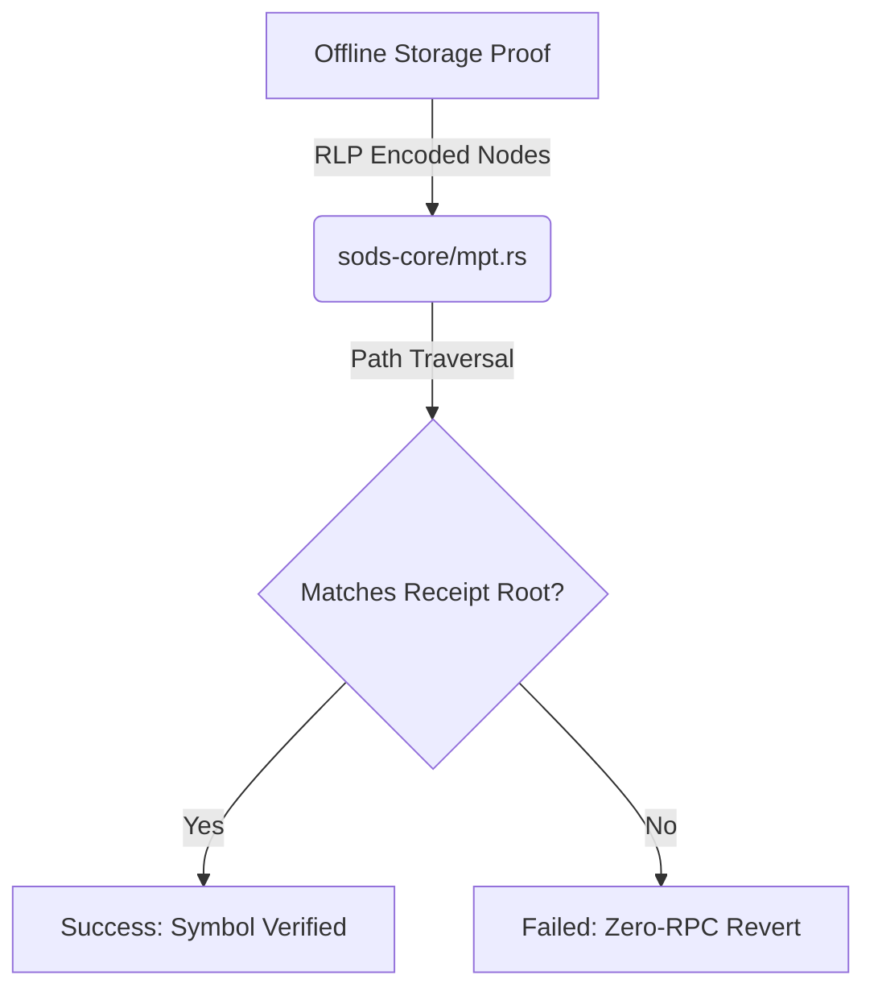

# Zero-RPC Verification Guide

A major milestone of the SODS Protocol Phase 3 maturity is the **Zero-RPC Verification** model.

## What is Zero-RPC Verification?

Normally, validating a Behavioral Merkle Tree (BMT) requires interacting with an Ethereum RPC to fetch block headers, verify Beacon Roots (EIP-4788), and query the target logs. 
However, **Zero-RPC mode** completely eliminates the need for live RPC requests, validating the data 100% locally.

## How it Works

Zero-RPC leverages Ethereum **Storage Proofs (EIP-1186)** and the **MPT (Merkle-Patricia Trie)** verifier embedded inside `sods-core/src/mpt.rs`.

Instead of asking a node "Does log X exist?", the user computes a static proof containing:
1. The block header's `receipts_root`.
2. The RLP-encoded components of the state trie proving the receipt exists.
3. The derived `leaf_hash` from the generated Behavioral Symbol.

Since all inputs are mathematically anchored to the `receipts_root`, `sods-verifier` can confirm the behavior without ever firing an HTTP request to an RPC provider.

## Usage in CLI

To run the SODS Protocol in strict Zero-RPC mode, use the `--mode storage-proof` flag:

```bash
sods verify Tf --block 6000000 --mode storage-proof
```

**Note**: In this mode, the CLI assumes that the initial storage proof data has been provided offline (e.g., via stdin or a local cache file). If the proof is missing, it will immediately fail, skipping any fallback RPC requests.

## Architecture



By decoupling verification from live web sockets and HTTP polling, SODS achieves true L1-agnostic decentralization.
