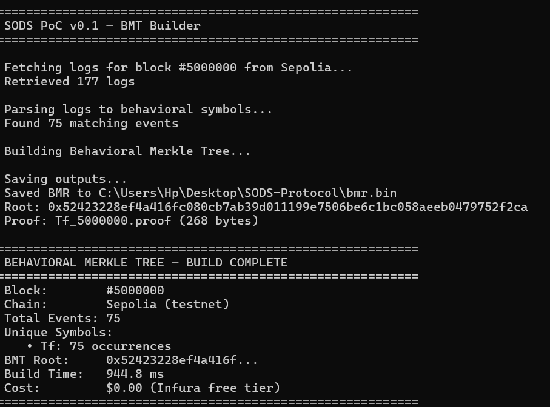
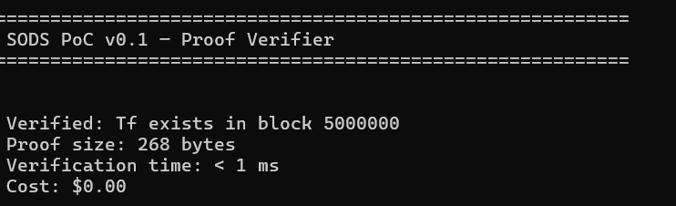
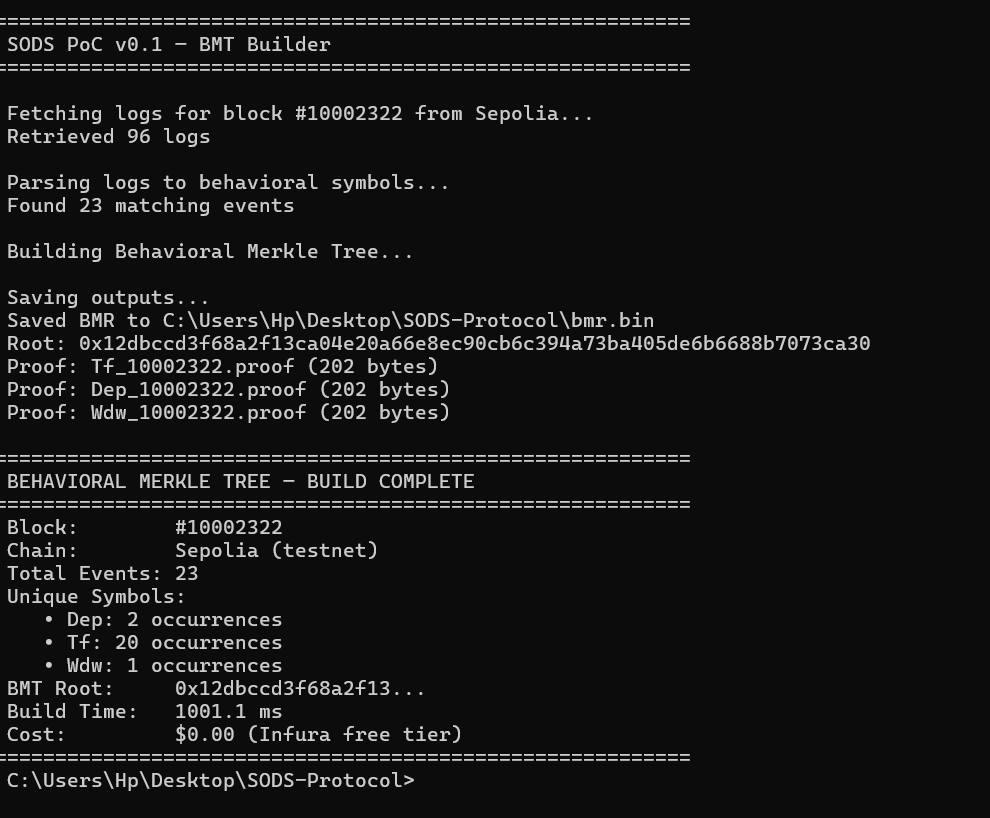
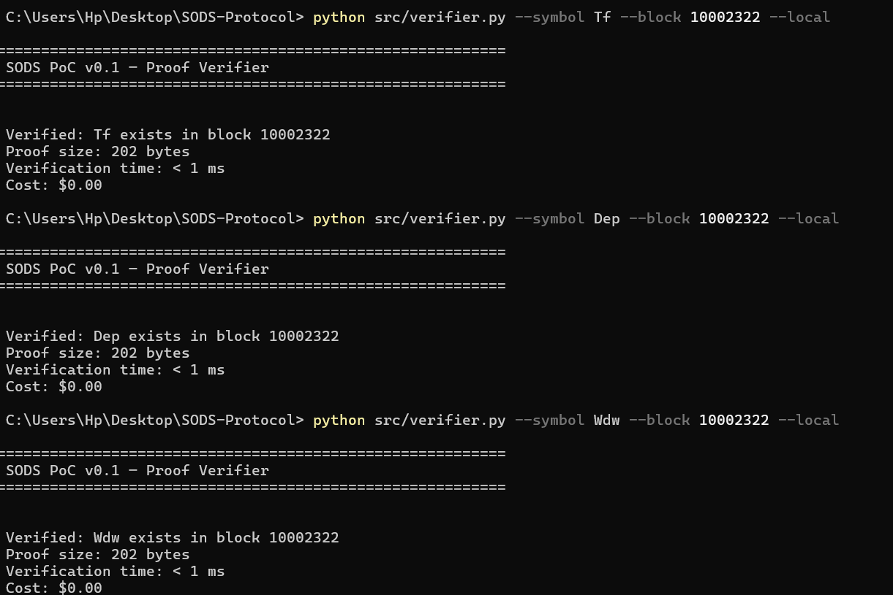

# SODS PoC v0.1 — "Can a Block Speak Behavior?"

> **Verified: 3 distinct behavioral patterns in a single Sepolia block — with 202-byte proofs, $0 cost, and zero data fetching.**

This Proof of Concept demonstrates the core idea of [SODS Protocol](/spec/SODS-RFC-v0.2.md):  
**Behavioral Merkle Trees (BMT)** enable cryptographic verification of on-chain *patterns* — without fetching full transactions.

---

## What Was Verified?

In **Sepolia block #10,002,322**:

| Symbol | Meaning              | Occurrences | Proof Size |
|--------|----------------------|-------------|------------|
| `Tf`   | ERC20 Transfer       | 20          | 202 bytes  |
| `Dep`  | WETH Deposit         | 2           | 202 bytes  |
| `Wdw`  | WETH Withdrawal      | 1           | 202 bytes  |

- All verified locally in **< 1 ms**
- Built using **Infura Free Tier** ($0 cost)
- No local node required

---

## Results

### Building the Behavioral Merkle Tree


### Verifying `Tf` (Transfer)


### Verifying `Dep` (WETH Deposit)


### Verifying `Wdw` (WETH Withdrawal)


---

## How to Run It

```bash
# Install requirements
pip install requests python-dotenv

# Set your Infura API key
cp .env.example .env
# Edit .env and add your Infura Project ID

# Build BMT for block 10002322
python bmt_builder.py

# Verify a symbol
python verifier.py --symbol Dep --block 10002322 --local
python verifier.py --symbol Tf --block 10002322 --local
python verifier.py --symbol Wdw --block 10002322 --local
```

> **Note**: You'll need an [Infura project ID](https://infura.io/) (free tier is sufficient).

---

## Files

| File | Description |
|------|-------------|
| `bmt_builder.py` | Fetches logs, parses symbols, builds Merkle tree |
| `verifier.py` | CLI tool to verify proofs locally |
| `merkle.py` | SHA-256 Merkle tree implementation |
| `config.py` | Configuration and symbol registry |
| `proofs/` | Generated proof files (202 bytes each) |
| `bmr.bin` | Behavioral Merkle Root (32 bytes) |

---

## Why This Matters

| Metric | Traditional APIs | SODS PoC |
|--------|------------------|----------|
| Cost | $500+/month | **$0** |
| Privacy | Data leaves your machine | **Local verification** |
| Trust | Centralized APIs | **Cryptographic proofs** |
| Speed | Network latency | **< 1 ms** |

**This proves: The blockchain can speak behavior.**

---

## Related

- [SODS Protocol RFC v0.2](/spec/SODS-RFC-v0.2.md) — Full specification
- [Main Repository README](../README.md)
